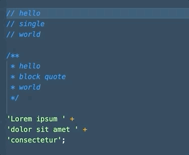

# Join Lines Context Aware

A language-agnostic, context-aware Join Lines command.



## Features

- Merge string literals - single or double quote, `+`, `.`, or nothing as concat operator
- Merges line and docblock comments (supports `//`, `#`, `*`, and `;`)
- Removes trailing commas and omits spaces when merging onto a line with an opening or closing brace (`[]`, `{}`, `()`, or `<>`)

## Usage

After installing the extension, add a keybinding for it. The default Join Lines command is `ctrl+j`:

```
{
  "key": "ctrl+j",
  "command": "join-lines-context-aware.join"
}
```

## Release Notes

Users appreciate release notes as you update your extension.

### 1.0.0

Initial release, ported from the [Join Lines Smarter Atom Extension](https://github.com/ianobermiller/join-lines-smarter).
